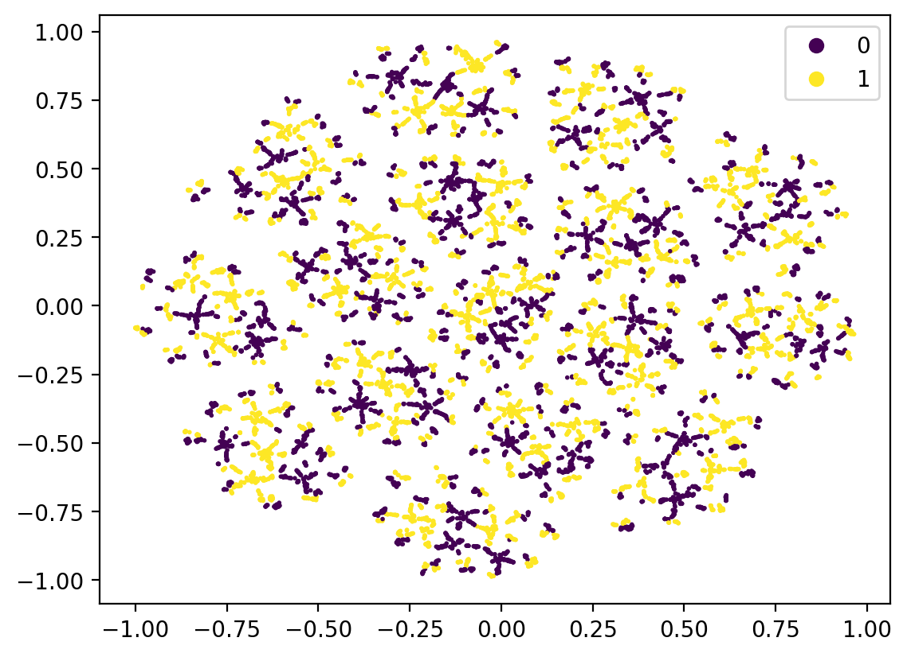
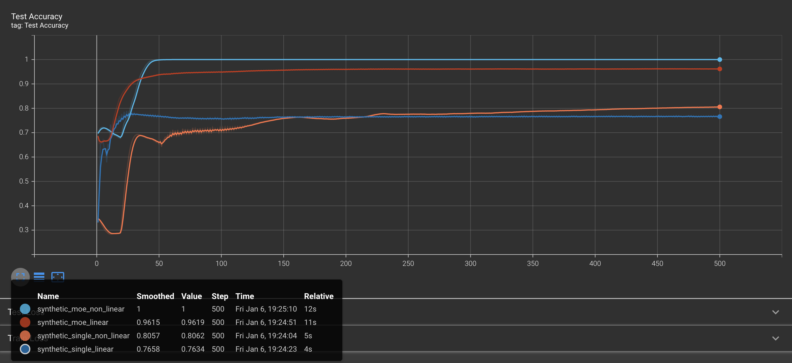

# A Pytorch Implementation of "Towards Understanding Mixture of Experts in Deep Learning"

This is my implementation of "Towards Understanding Mixture of Experts in Deep Learning" which is accepted at NeurIPS 2022.

Which still has a lot of work to do.

**NOTE: I am not an author of the paper!!**

Below is the tsne visualization of synthetic data.

Figure 1. Each color denotes a cluster in synthetic data

Figure 2. Labels on each data point in synthetic data

## Performance
- Performance after 500 epoch

Figure 3. Accuracy and loss graph on each setting of model

|                    | Test accuracy (%) | Number of Filters |
|--------------------|-------------------|-------------------|
| Single (linear)    |              76.3 |               512 |
| Single (nonlinear) |              80.6 |               512 |
| MoE (linear)       |              96.2 |        128 (16*8) |
| MoE (nonlinear)    |              1.00 |        128 (16*8) |

Figure 4. A linear moe model that learns to dispatch data points to 8 experts.

Figure 5. A non-linear moe model that learns to dispatch data points to 8 experts

## Future work
### Model side
1. Add dispatch entropy evaluation
2. Support on Language & Image dataset
3. Replicate results on linear/non-linear MoE

### Dataset side
1. Fix synthetic data generation
    - Add cluster label for entropy evaluation
- On current version seems different from Figure 1 in the original paper

## Reference
~~~
@misc{https://doi.org/10.48550/arxiv.2208.02813,
  doi = {10.48550/ARXIV.2208.02813},
  url = {https://arxiv.org/abs/2208.02813},
  author = {Chen, Zixiang and Deng, Yihe and Wu, Yue and Gu, Quanquan and Li, Yuanzhi},
  keywords = {Machine Learning (cs.LG), Artificial Intelligence (cs.AI), Machine Learning (stat.ML), FOS: Computer and information sciences, FOS: Computer and information sciences},
  title = {Towards Understanding Mixture of Experts in Deep Learning},
  publisher = {arXiv},
  year = {2022},
  copyright = {arXiv.org perpetual, non-exclusive license}
}
~~~